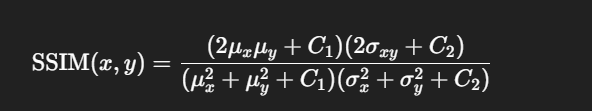
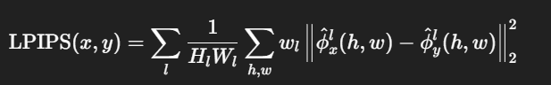

# Image Restoration System

## Project
**A Unified Deep Learning Framework for Multi-Task Image and Video Restoration**  
(Inpainting, Frame Interpolation, Colorization, and Denoising)

---

## Overview
This repository implements a modular pipeline for restoring degraded imagery and video. The system integrates four primary restoration tasks:

1. **Image Inpainting** — fill missing regions and holes.  
2. **Frame Interpolation** — reconstruct missing video frames and smooth temporal discontinuities.  
3. **Colorization** — convert grayscale images/frames to plausible color.  
4. **Denoising** — remove sensor noise, motion blur, and compression artifacts.

The architecture is intentionally minimal to accelerate experimentation and demoing while remaining extensible for research and production workflows.

---

## Features
- Modular service wrappers per task (PyTorch-based).  
- Simple Gradio demo (`app.py`) for uploads, task selection and visualization.  
- Metrics for objective evaluation: PSNR, SSIM, LPIPS (optional).  
- Example pipelines (single-task or chained multi-task restoration).  
- Sample datasets and utilities for IO and visualization.

---

## Quickstart (local / Colab)
1. Clone the repository:
   ```bash
   git clone <your-repo-url>
   cd image-restoration-system
   ```

2. Install Dependencies:
   ``` bash
   python -m venv venv
    source venv/bin/activate         # Linux / macOS
    venv\Scripts\activate            # Windows (PowerShell)
    pip install -r requirements.txt
   ```
3. Run the Gradio demo:
   ``` py
     python app.py
   ```
4. Open the provided Gradio URL in your browser.
   
## File Structure

``` text
image-restoration-system/
│
├── app.py                     # Gradio UI entrypoint
├── requirements.txt
├── README.md
│
├── models/
│   ├── inpainting/            # LaMa weights / configs
│   ├── interpolation/         # RIFE weights / configs
│   ├── colorization/          # ECCV16 weights / code
│   └── denoising/             # DnCNN / pytorch weights
│
├── pipeline/
│   ├── router.py              # Task decision & chaining logic
│   └── processor.py           # Inference orchestration
│
├── services/
│   ├── inpaint_service.py
│   ├── interpolate_service.py
│   ├── colorize_service.py
│   └── denoise_service.py
│
├── utils/
│   ├── io_utils.py
│   └── metrics.py
│
└── data/
    └── samples/
```

### Models
LaMa — resolution-robust large-mask image inpainting.
Repository: https://github.com/advimman/lama

RIFE — real-time intermediate flow estimation for frame interpolation.
Repository: https://github.com/hzwer/ECCV2022-RIFE

ECCV16 — Colorful Image Colorization (Zhang et al.).
Repository: https://github.com/richzhang/colorization

DnCNN — residual learning CNN for image denoising.
Repository: https://github.com/cszn/DnCNN

### Datasets

Inpainting: Places2, CelebA-HQ (use curated subsets for experiments).

Interpolation: Vimeo90K triplet dataset or custom frame pairs.

Colorization: ImageNet / Places365 (use grayscale conversions for supervised training).

Denoising: BSD400, SIDD (real-noise).


1. Peak Signal-to-Noise Ratio (PSNR)

For two images 𝑋 (reference) and 𝑋^ (reconstruction) with 𝑀×𝑁 pixels and maximum pixel value 𝑀𝐴𝑋 (e.g., 255):<br/>
![Peak Signal to Noise Ratio]!(assets/image.png)

2. Structural SIMilarity Index (SSIM)

SSIM compares luminance, contrast and structure between local windows. For patches 𝑥,𝑦:<br/>


Mean SSIM (over the image) is the reported metric. SSIM ∈ [−1, 1], but practically in [0,1] for natural images.

3. Learned Perceptual Image Patch Similarity (LPIPS)

LPIPS uses deep network features 𝜙(⋅) to measure perceptual distance:<br/>


where 𝑙 indexes layers, 𝑤𝑙 are learned layer-wise weights and 𝜙^ denotes normalized activations. Lower LPIPS is better (closer perceptual similarity).

